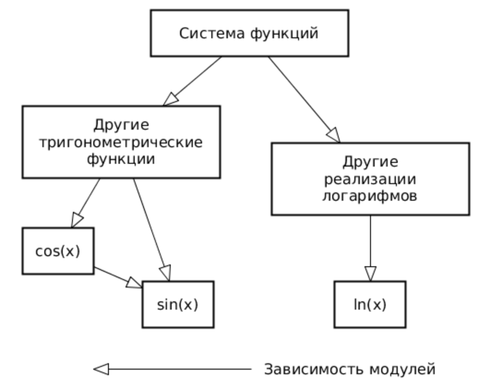

# software-testing

## Вариант 95133987

Провести интеграционное тестирование программы, осуществляющей вычисление системы функций (в соответствии с вариантом).


- x <= 0

```text
(((((((((((((((((cot(x) ^ 3) - cos(x)) + cos(x)) - tan(x)) + cos(x)) - csc(x)) - cot(x)) - sec(x)) / cot(x)) ^ 3) * cot(x)) / sec(x)) + ((((cot(x) - tan(x)) * tan(x)) - (((sec(x) + (cos(x) + (((csc(x) ^ 3) / tan(x)) ^ 3))) / (tan(x) * tan(x))) / (cos(x) + (cot(x) - cot(x))))) + tan(x))) / (((((((sin(x) + (csc(x) ^ 2)) * ((csc(x) - (tan(x) - (cos(x) * (sec(x) ^ 2)))) / cot(x))) * cos(x)) - csc(x)) - (cot(x) + cot(x))) + (sec(x) - (tan(x) + cot(x)))) - (sin(x) / ((cos(x) * cos(x)) * (sec(x) * sin(x)))))) / ((cot(x) / (csc(x) - ((tan(x) * sin(x)) * (((cos(x) / sin(x)) - sin(x)) / (sec(x) * sec(x)))))) / ((cos(x) - tan(x)) + cot(x)))) - ((sin(x) * (((((sin(x) * csc(x)) - sec(x)) - (cot(x) + (((sec(x) ^ 3) / cos(x)) ^ 2))) * csc(x)) - cos(x))) ^ 3)) / (tan(x) + (((csc(x) - cos(x)) ^ 2) * (csc(x) ^ 2))))
```

- x > 0

```text
(((((log_10(x) / log_3(x)) ^ 2) - log_5(x)) / log_5(x)) - ((log_2(x) - log_10(x)) * log_3(x)))
```

### Правила выполнения работы

1. Все составляющие систему функции (как тригонометрические, так и логарифмические) должны быть выражены через базовые (тригонометрическая - синус; логарифмическая - натуральный логарифм).
2. Структура приложения, тестируемого в рамках лабораторной работы, должна выглядеть следующим образом (пример приведён для базовой тригонометрической функции sin(x)):

    

3. Обе "базовые" функции (в примере выше - sin(x) и ln(x)) должны быть реализованы при помощи разложения в ряд с задаваемой погрешностью. Использовать тригонометрические / логарифмические преобразования для упрощения функций ЗАПРЕЩЕНО.
4. Для КАЖДОГО модуля должны быть реализованы табличные заглушки. При этом, необходимо найти область допустимых значений функций, и, при необходимости, определить взаимозависимые точки в модулях.
5. Разработанное приложение должно позволять выводить значения, выдаваемое любым модулем системы, в сsv файл вида «X, Результаты модуля (X)», позволяющее произвольно менять шаг наращивания Х. Разделитель в файле csv можно использовать произвольный.

### Порядок выполнения работы

1. Разработать приложение, руководствуясь приведёнными выше правилами.
2. С помощью Junit 5 разработать тестовое покрытие системы функций, проведя анализ эквивалентности и учитывая особенности системы функций. Для анализа особенностей системы функций и составляющих ее частей можно использовать сайт [wolframalpha](https://www.wolframalpha.com/).
3. Собрать приложение, состоящее из заглушек. Провести интеграцию приложения по 1 модулю, с обоснованием стратегии интеграции, проведением интеграционных тестов и контролем тестового покрытия системы функций.

### Отчет по работе должен содержать

1. Текст задания, систему функций.
2. UML-диаграмму классов разработанного приложения.
3. Описание тестового покрытия с обоснованием его выбора.
4. Графики, построенные csv-выгрузкам, полученным в процессе интеграции приложения.
5. Выводы по работе.

### Вопросы к защите лабораторной работы

1. Цели и задачи интеграционного тестирования. Расположение фазы интеграционного тестирования в последовательности тестов; предшествующие и последующие виды тестирования ПО.
2. Алгоритм интеграционного тестирования.
3. Концепции и подходы, используемые при реализации интеграционного тестирования.
4. Программные продукты, используемые для реализации интеграционного тестирования. Использование JUnit для интеграционных тестов.
5. Автоматизация интеграционных тестов. ПО, используемое для автоматизации интеграционного тестирования.

## Правила сдачи работы

- [Общие](https://se.ifmo.ru/~nnaumova/)
- [ТПО](https://se.ifmo.ru/~nnaumova/tpo.html)

## Авторы

> Тучков Максим Русланович
>
> Кондратьева Ксения Михайловна
